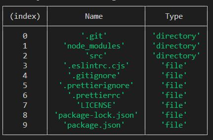

# Aufgabe: Dateimanager

## Beschreibung

Ihre Aufgabe ist es, einen Dateimanager mit Node.js-APIs zu implementieren.

Der Dateimanager sollte Folgendes können:

- Über CLI arbeiten
- Grundlegende Dateioperationen durchführen (kopieren, verschieben, löschen, umbenennen usw.)
- Streams API verwenden
- Informationen über das Betriebssystem des Host-Computers abrufen
- Hash-Berechnungen durchführen
- Dateien komprimieren und dekomprimieren

## Technische Anforderungen

- Es dürfen keine externen Abhängigkeiten verwendet werden.
- Verwenden Sie die Version 20 LTS von Node.js.
- Das Programm wird durch das npm-Skript `start` wie folgt gestartet:
```bash
npm run start -- --username=your_username
```
- Nach dem Start zeigt das Programm den folgenden Text in der Konsole an (`Username` ist gleich dem Wert, der beim Start der Anwendung im `--username` CLI-Argument übergeben wurde):  
  `Willkommen im Dateimanager, Username!`
- Nachdem die Programmarbeit beendet ist (`ctrl + c` gedrückt oder der Benutzer den Befehl `.exit` in die Konsole eingegeben hat), zeigt das Programm den folgenden Text in der Konsole an:  
  `Vielen Dank, dass Sie den Dateimanager verwendet haben, Username, auf Wiedersehen!`
- Zu Beginn des Programms und nach jedem Ende der Eingabe/Operation sollte das aktuelle Arbeitsverzeichnis wie folgt angezeigt werden:  
  `Sie befinden sich derzeit im path_to_working_directory`
- Das Startarbeitsverzeichnis ist das Home-Verzeichnis des aktuellen Benutzers (zum Beispiel unter Windows ist das etwas wie `system_drive/Users/Username`).
- Das Programm sollte standardmäßig den Benutzer in der Konsole auffordern, Befehle einzugeben und auf Ergebnisse zu warten.
- Bei unbekannter Operation oder ungültiger Eingabe (fehlende erforderliche Argumente, falsche Daten in Argumenten usw.) sollte die Nachricht `Ungültige Eingabe` angezeigt werden, und der Benutzer sollte einen weiteren Befehl eingeben können.
- Im Falle eines Fehlers bei der Ausführung einer Operation sollte die Nachricht `Operation fehlgeschlagen` angezeigt werden, und der Benutzer sollte einen weiteren Befehl eingeben können (zum Beispiel sollte der Versuch, eine Operation an einer nicht existierenden Datei durchzuführen oder auf einem nicht existierenden Pfad zu arbeiten, zum Fehlschlagen der Operation führen).
- Der Benutzer kann nicht höher als das Root-Verzeichnis gehen (zum Beispiel auf Windows ist das das Stammverzeichnis des aktuellen Laufwerks). Wenn der Benutzer dies versucht, ändert sich das aktuelle Arbeitsverzeichnis nicht.

Liste der Operationen und deren Syntax:
- Navigation & Arbeitsverzeichnis (nwd)
    - Nach oben im aktuellen Verzeichnis gehen (wenn Sie sich im Root-Ordner befinden, sollte diese Operation das Arbeitsverzeichnis nicht ändern):
    ```bash
    up
    ```
    - In einen bestimmten Ordner vom aktuellen Verzeichnis aus wechseln (`path_to_directory` kann relativ oder absolut sein):
    ```bash
    cd path_to_directory
    ```
    - Liste aller Dateien und Ordner im aktuellen Verzeichnis in der Konsole ausgeben. Die Liste sollte enthalten:
        - Dateinamen und Ordnernamen (bei Dateien mit Erweiterung)
        - Ordner und Dateien sind in aufsteigender alphabetischer Reihenfolge sortiert, wobei die Liste der Ordner zuerst kommt
        - Der Typ des Verzeichnisinhalts sollte explizit gekennzeichnet werden (zum Beispiel als entsprechende Spaltenwert)
    ```bash
    ls
    ```
  Beispiel, wie die Ausgabe des Befehls `ls` aussehen könnte:  
  
- Grundlegende Dateioperationen
    - Datei lesen und ihren Inhalt in der Konsole ausgeben (sollte mit Readable Stream erfolgen):
    ```bash
    cat path_to_file
    ```
    - Leere Datei im aktuellen Arbeitsverzeichnis erstellen:
    ```bash
    add new_file_name
    ```
    - Datei umbenennen (der Inhalt sollte unverändert bleiben):
    ```bash
    rn path_to_file new_filename
    ```
    - Datei kopieren (sollte mit Readable und Writable Streams erfolgen):
    ```bash
    cp path_to_file path_to_new_directory
    ```
    - Datei verschieben (wie kopieren, aber die ursprüngliche Datei wird gelöscht, der Kopiervorgang sollte mit Readable und Writable Streams erfolgen):
    ```bash
    mv path_to_file path_to_new_directory
    ```
    - Datei löschen:
    ```bash
    rm path_to_file
    ```
- Betriebssysteminformationen (zeigt folgende Informationen in der Konsole an):
    - EOL (End-Of-Line des Systems) abrufen und in der Konsole ausgeben:
    ```bash
    os --EOL
    ```
    - Informationen zu den CPUs des Host-Computers abrufen (Gesamtanzahl der CPUs sowie Modell und Taktfrequenz (in GHz) für jede von ihnen) und in der Konsole ausgeben:
    ```bash
    os --cpus
    ```
    - Home-Verzeichnis abrufen und in der Konsole ausgeben:
    ```bash
    os --homedir
    ```
    - Aktuellen *Systembenutzernamen* abrufen (nicht zu verwechseln mit dem Benutzernamen, der beim Start der Anwendung festgelegt wird) und in der Konsole ausgeben:
    ```bash
    os --username
    ```
    - CPU-Architektur, für die das Node.js-Binary kompiliert wurde, abrufen und in der Konsole ausgeben:
    ```bash
    os --architecture
    ```
- Hash-Berechnung
    - Hash für Datei berechnen und in der Konsole ausgeben:
    ```bash
    hash path_to_file
    ```
- Komprimierungs- und Dekomprimierungsoperationen
    - Datei komprimieren (unter Verwendung des Brotli-Algorithmus, sollte mit Streams API erfolgen):
    ```bash
    compress path_to_file path_to_destination
    ```
    - Datei dekomprimieren (unter Verwendung des Brotli-Algorithmus, sollte mit Streams API erfolgen):
    ```bash
    decompress path_to_file path_to_destination
    ```  
  NB! Nach der Dekomprimierung einer zuvor komprimierten Datei sollte das Ergebnis mit der ursprünglich komprimierten Datei übereinstimmen.