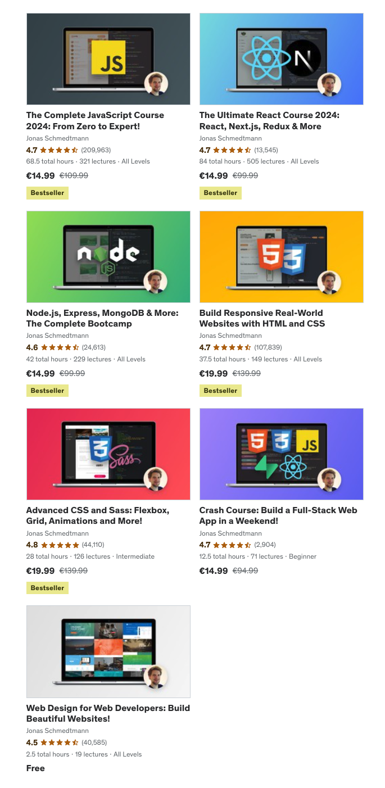

# Node.js basics

nodejs short course in german.

## Links

Links to the nodejs basics course.

### Node

* [Introduction to Node.js](https://nodejs.org/en/learn/getting-started/introduction-to-nodejs#introduction-to-nodejs)
* [Node.js documentation](https://nodejs.org/en/docs/)

### Test

* [Jest](https://jestjs.io/)
* [Chai](https://www.chaijs.com/)
* [Vitest](https://vitest.dev/)
* [Cypress](https://www.cypress.io/)
* [Playwright](https://playwright.dev/)
* [Selenium](https://www.selenium.dev/)

### Frameworks

* [NestJS](https://nestjs.com/)
* [Express](https://expressjs.com/)
* [Fastify](https://www.fastify.io/)

### DB

* [MongoDB](https://www.mongodb.com/)
* [Prisma](https://www.prisma.io/)
* [TypeORM](https://typeorm.io/)

### Video Courses

